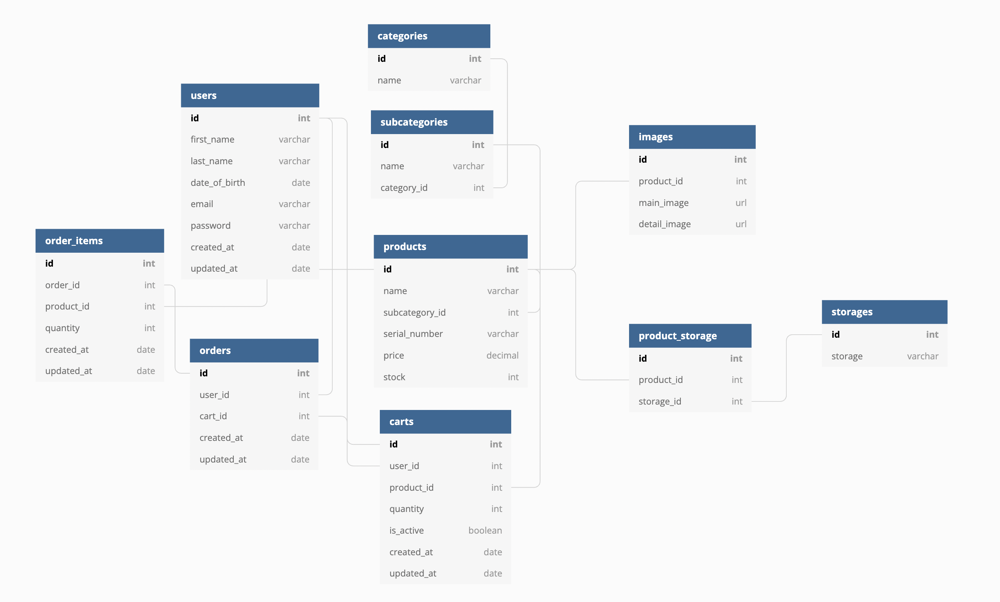

# 28-1st-Gamsung-backend
> 삼성전자(www.https://www.samsung.com/sec/)는 전자제품을 제조하는 다국적 기업입니다.
> 이커머스 웹사이트의 기능 구현 실습을 위해 일부 상품군(모바일-스마트폰)을 선별하여 프로젝트를 진행하였습니다.

 

## 개발인원 및 기간
- 개발기간 : 2021-12-27 ~ 2022-01-07
- Front-end : (https://github.com/wecode-bootcamp-korea/28-1st-Gamsung-frontend)
- Back-end : 강민성, 정병연
  공통  : ERD/Modeling, CSV Uploader
  강민성 : ProductListView, ProductDetailView
  정병연 : SignUpView, SignInView, CartView, Login 데코레이터, 정규성검사

## 협업 도구
- slack
- Github
- Trello

## 적용 기술
- Python, Django, MySQL, Git

## library
- JWT

## 구현 기능

### User
- SignUp : 정규성 검사를 통한 회원가입 진행
- Decorator : 로그인시 JWT 토큰 발행 및 토큰 인가로 호스트 등록
- Cart  : 장바구니 CRUD

### Product
- 필터링, 정렬, 검색
- Pagination

## ERD

## Reference
- 이 프로젝트는 [**Samsung**](www.https://www.samsung.com/sec/) 사이트를 참조하여 학습목적으로 만들었습니다.
- 실무 수준의 프로젝트이지만 학습용으로 만들었기 때문에 이 코드를 활용하여 이득을 취하거나 무단 배포할 경우 법적으로 문제가 될 수 있습니다.
- 이 프로젝트에서 사용하고 있는 사진 대부분은 위코드에서 구매한 것이므로 해당 프로젝트 외부인이 사용할 수 없습니다.